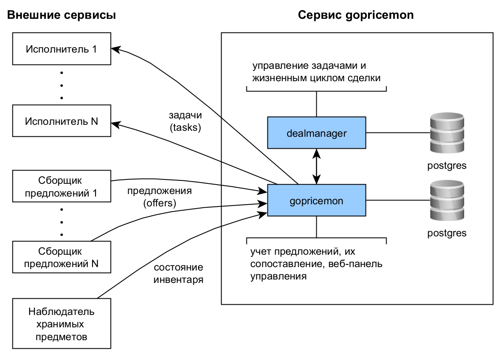
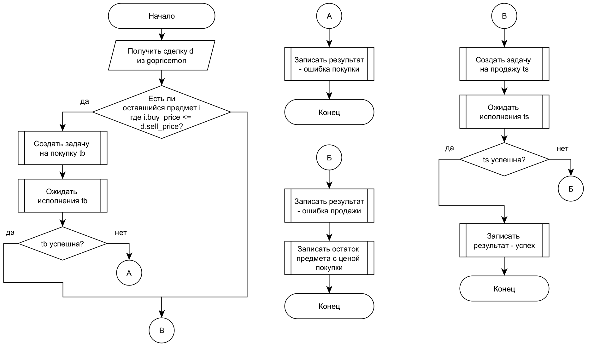

# Сервис мониторинга цен gopricemon

Задача проекта - обработка данных о предложениях покупки/продажи для рекомендации спекулятивных сделок.
В процессе реализации добавлена возможность автоматического управления задачами для выполнения сделки.

Для взаимодействия с системой используется Web интерфейс ([снимки экрана](./docs/screenshots/)) и [HTTP API](./api/openapi.yaml).



В состав входят 2 микросервиса:

- gopricemon - обрабатывает офферы и предлагает сделки, а также позволяет управлять заданиями на покупку/продажу предметов
- dealmanager - управляет жизненным циклом сделки купить-продать с обработкой ошибочных ситуаций

## Внешние сервисы

Если задача состоит в упрощении ручных сделок, необходимо:

1. Реализовать сборщики данных - например, парсеры сайтов
2. Настроить передачу предложений в gopricemon (HTTP API)
3. Открыть `/summary` => использовать [сравнительную таблицу](./docs/screenshots/summary-table.png)

Если задача состоит в автоматическом исполнении сделок, необходимо дополнительно:

1. Реализовать исполнителей задач
2. Подключить опрос запланированных задач gopricemon (HTTP API)
3. Запустить dealmanager для управления сделками

## Схема алгоритма работы dealmanager



## Запуск

Требования

- Docker Compose
- Go >= 1.26.1
- Файл конфигурации `.env` по подобию `.env.example`

Запуск СУБД Postgres

```bash
./up-db-only.sh
```

Запуск микросервисов без Docker Compose

```bash
go run ./cmd/migrate up # инициализация СУБД и миграции goose
go run ./cmd/migrate-dealmanager up
go run ./cmd/gopricemon
go run ./cmd/dealmanager # при необходимости функционала dealmanager
```

Запуск с использованием Docker

```bash
docker compose up -d --build
```

## Ограничения

**Данный сервис является агрегатором данных и управляет задачами по покупке/продаже. Без интеграции со сборщиками данных (platforms) и исполнителями (executors) самостоятельно парсить площадки, покупать/продавать предметы он не будет.**
